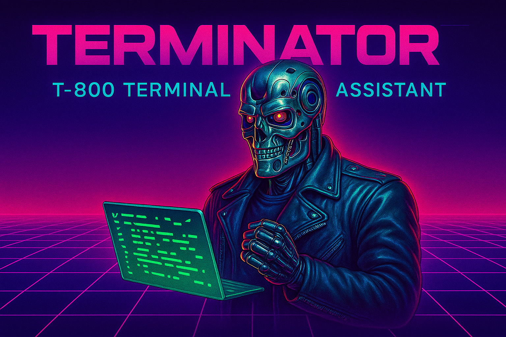

# 🤖💥 Terminator - Terminal Session Manager



*Keep Cursor, Windsurf, and other AI coding assistants working without disruption.*

*"I'll be back... to manage your Terminal sessions."*

---

## Mission Briefing

**Terminator** is an advanced AppleScript-powered Terminal session manager designed to hunt down inefficient workflows and terminate them with extreme prejudice. This cybernetic organism solves a critical problem in AI coding assistants: **the dreaded hanging command loop break**.

### The Problem: Loop Termination

When AI coding assistants like Cursor execute commands that hang or run indefinitely, they break their execution loop and become unresponsive. This forces developers to:
- Manually intervene and kill processes
- Restart the AI assistant
- Lose context and momentum
- Experience frustrating workflow interruptions

**The result?** Productivity crashes harder than Skynet's network.

### The Solution: Process Isolation

Terminator implements **process isolation** by running commands in separate Terminal sessions. This means:
- ✅ **Loop Continuity**: AI assistant stays responsive even with hanging commands
- ✅ **Faster Execution**: Commands run asynchronously in dedicated processes
- ✅ **Better Control**: Intelligent process termination when needed
- ✅ **Context Preservation**: Session state persists across operations

### Core Directive

Just like the T-800's mission to protect, Terminator's primary objective is to **protect your development loop** by:
- Creating and managing persistent Terminal sessions
- Isolating command execution from AI assistant processes
- Grouping related tasks by project 
- Intelligently interrupting busy processes when needed
- Providing reliable session state management

---

## Deployment Instructions

### Training Your AI Assistant

To maximize loop performance, train your AI coding assistant (Cursor, Claude Code, etc.) to use Terminator instead of direct shell execution:

**❌ Instead of this (loop-breaking):**
```bash
# Direct execution - can hang and break the loop
npm run build
```

**✅ Use this (loop-preserving):**
```bash
# Terminator execution - keeps the loop alive
osascript terminator.scpt "/path/to/project" "build" "npm run build"
```

### Basic Command Structure
```bash
osascript terminator.scpt ["/project/path"] "task_tag" ["command"] [lines]
```

### Mission Parameters
- **Project Path** *(optional)*: Absolute path for project grouping
- **Task Tag** *(required)*: Unique identifier for the terminal session
- **Command** *(optional)*: Shell command to execute
- **Lines** *(optional)*: Number of output lines to return (default: 30)

---

## Combat Examples

### 🎯 Target Acquisition (New Project)
Establish a new project perimeter and execute reconnaissance:
```bash
osascript terminator.scpt "/Users/connor/Projects/SkyNet" "build_defense" "cd /Users/connor/Projects/SkyNet && npm run build"
```

### 🔄 Continuous Operations (Existing Project)
Execute follow-up commands in the same tactical session:
```bash
osascript terminator.scpt "/Users/connor/Projects/SkyNet" "build_defense" "npm run test"
```

### 🆕 Multiple Fronts (Additional Tasks)
Open new operational theaters within the same project:
```bash
osascript terminator.scpt "/Users/connor/Projects/SkyNet" "api_surveillance" "cd backend && python manage.py runserver"
```

### 👁️ Intelligence Gathering (Read-Only)
Retrieve status reports from active sessions:
```bash
osascript terminator.scpt "build_defense" 50
```

### 🛠️ Base Preparation (Session Setup)
Establish a session without immediate deployment:
```bash
osascript terminator.scpt "/Users/connor/Projects/SkyNet" "standby_mode" "" 1
```

---

## Advanced Tactical Features

### 🎯 **Fuzzy Target Grouping**
- Automatically groups related tasks in the same project window
- Uses intelligent pattern matching for session organization
- Configurable via `enableFuzzyTagGrouping` property

### ⚡ **Process Termination Protocol**
- Automatically interrupts busy processes when reusing sessions
- Uses progressive termination: INT signal → KILL signal → Control-C
- Tracks process states and provides detailed status reports

### 📊 **Session Intelligence**
- Real-time monitoring of terminal session states
- TTY tracking for precise process management
- Comprehensive error reporting and status updates

### 🛡️ **Error Resistance**
- Handles edge cases and terminal state conflicts
- Provides fallback mechanisms for session recovery
- Timeout protection for long-running commands

---

## Configuration Arsenal

Key properties that can be modified in the script:

```applescript
property maxCommandWaitTime : 10.0          -- Command timeout (seconds)
property defaultTailLines : 30               -- Default output lines
property tabTitlePrefix : "Terminator 🤖💥 " -- Session identifier prefix
property enableFuzzyTagGrouping : true       -- Smart grouping enabled
```

---

## System Requirements

### Permissions Protocol
Ensure these applications have **Automation** permissions:
- **Terminal.app** - Primary target application
- **System Events.app** - System control interface

*Access via: System Preferences → Security & Privacy → Privacy → Automation*

---

## Troubleshooting

### Mission Failed Scenarios

**"Terminal session not found"**
- Provide a command or empty command with lines to create the session
- Ensure project path is absolute when establishing new contexts

**"Process may still be running"**
- Terminator attempted to interrupt but the process resisted termination
- Check terminal manually or wait for natural process completion

**"Permission denied"**
- Verify Automation permissions for Terminal.app and System Events.app
- Restart Terminal.app after granting permissions

---

## Enhanced Automation Arsenal

### 🔗 Useful MCP Servers to Increase the Loop

Supercharge your development loop with these Model Context Protocol servers:

- **[macOS Automator MCP](https://github.com/steipete/macos-automator-mcp)** - Execute AppleScript and shell commands directly from Claude Code
- **[Claude Code MCP](https://github.com/steipete/claude-code-mcp)** - Enhanced Claude Code integration with file system operations

These MCPs work seamlessly with Terminator to maximize your development loop efficiency and keep your AI assistant running smoothly.

---

## The Terminator's Promise

*"Come with me if you want to live... productively with organized Terminal sessions."*

**Terminator** will be your faithful cybernetic companion, tirelessly managing your Terminal workflows until the very last command is executed. No process left behind, no session unmanaged.

---

*Terminator is future-proof and designed to adapt to your evolving development workflows. Resistance is futile.*