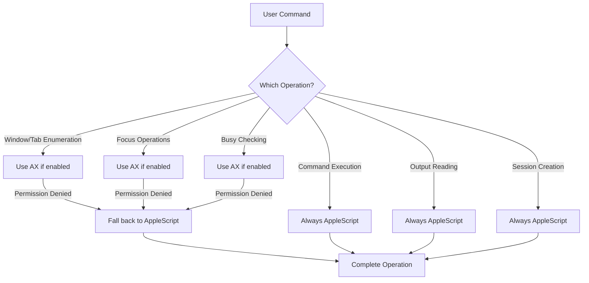

# Hybrid Mode Feature Breakdown: Accessibility vs AppleScript

## Features That Can Use Accessibility APIs (AXorcist)

### 1. Window Enumeration ✅
- **What**: Finding all terminal windows
- **How**: Using AXUIElement to traverse the window hierarchy
- **Performance**: ~10x faster than AppleScript
- **Code Location**: `HybridTerminalControlBase.listSessionsViaAccessibility()`
- **Feature Flag**: `TERMINATOR_AX_WINDOWS=true`

### 2. Tab Discovery ✅
- **What**: Finding all tabs within windows
- **How**: Traversing AXTabGroup elements and finding AXRadioButton children
- **Performance**: Significantly faster, especially with many tabs
- **Code Location**: `findTerminalTabs()`, `findITermTabs()`
- **Feature Flag**: `TERMINATOR_AX_WINDOWS=true`

### 3. Tab/Window Titles ✅
- **What**: Reading window and tab titles
- **How**: Using `kAXTitleAttribute` on UI elements
- **Performance**: Instant access without script compilation
- **Code Location**: `getTitle()`, `getTerminalTabTitle()`
- **Feature Flag**: `TERMINATOR_AX_WINDOWS=true`

### 4. Focus Operations ✅
- **What**: Bringing windows/tabs to front
- **How**: Using AX actions like `kAXRaiseAction`, `kAXFocusedAttribute`
- **Performance**: Much faster and more reliable
- **Code Location**: `focusSessionViaAccessibility()`
- **Feature Flag**: `TERMINATOR_AX_FOCUS=true`
- **Operations**:
  - Activate application
  - Raise window
  - Select specific tab
  - Set window as main/focused

### 5. Busy State Detection ✅
- **What**: Checking if a terminal is busy
- **How**: Reading `AXBusy` attribute on text areas
- **Performance**: Instant vs parsing process lists
- **Code Location**: `isTerminalTabBusy()`
- **Feature Flag**: `TERMINATOR_AX_BUSY=true`

### 6. UI Element State ✅
- **What**: Reading various UI element properties
- **How**: Direct attribute access via AXUIElement
- **Performance**: No script overhead
- **Available Attributes**:
  - Position and size
  - Enabled/disabled state
  - Selected state
  - Visibility

## Features That MUST Use AppleScript

### 1. Command Execution ❌
- **Why**: No AX API to execute shell commands in terminals
- **What AppleScript Does**: `do script "command" in tab`
- **Code Location**: `executeCommandViaAppleScript()`
- **No Alternative**: This is core terminal functionality

### 2. Terminal Output Reading ❌
- **Why**: AX only provides visible text, not scrollback buffer
- **What AppleScript Does**: Access to `contents` and `history` properties
- **Code Location**: `readSessionOutputViaAppleScript()`
- **Limitation**: AX would only show currently visible lines

### 3. TTY Path Access ❌
- **Why**: TTY device path is not exposed via accessibility
- **What AppleScript Does**: Direct access to `tty` property
- **Code Location**: Part of session discovery
- **Critical For**: Process management and session identification

### 4. Process Information ❌
- **Why**: PID and process details not available via AX
- **What AppleScript Does**: Access to process properties
- **Code Location**: `killProcessInSessionViaAppleScript()`
- **Used For**: Process termination and management

### 5. Session Creation ❌
- **Why**: Creating new tabs/windows requires scripting
- **What AppleScript Does**: `make new tab`, `make new window`
- **Code Location**: `findOrCreateSession()`
- **No Alternative**: UI automation can't create new elements

### 6. Custom Tab Titles ❌
- **Why**: Setting titles requires script commands
- **What AppleScript Does**: `set custom title of tab`
- **Code Location**: Session creation and management
- **Critical For**: Session identification system

### 7. Terminal-Specific Features ❌
- **Why**: Each terminal has unique AppleScript properties
- **Examples**:
  - iTerm profiles and advanced settings
  - Terminal.app specific configurations
  - Ghosty custom properties
- **No AX Equivalent**: These are application-specific

## Hybrid Operation Flow

## Performance Implications

### Operations That Benefit Most from AX:
1. **Listing Sessions**: Especially with many windows/tabs
2. **Focus Operations**: No script compilation overhead
3. **Repeated UI Queries**: AX elements can be cached
4. **Busy Checking**: Direct attribute vs process parsing

### Operations with No Performance Change:
1. **Command Execution**: Still requires AppleScript
2. **Output Reading**: Still requires AppleScript
3. **Process Management**: Mixed (UI via AX, process via AS)

## Recommendations for Future Enhancement

### 1. Maximize AX Usage
- Implement caching for frequently accessed UI elements
- Use batch operations where possible
- Optimize element search algorithms

### 2. Minimize AppleScript Calls
- Batch multiple AppleScript operations
- Cache TTY paths and process info when possible
- Reduce frequency of output polling

### 3. Potential AXorcist Enhancements
- Add specialized terminal window/tab finders
- Implement smart caching strategies
- Add performance monitoring utilities

### 4. Future Possibilities
- Investigate if newer macOS versions expose more via AX
- Explore if terminal apps could expose custom AX attributes
- Consider hybrid operations (e.g., find via AX, operate via AS)

## Summary

The hybrid implementation strategically uses Accessibility APIs for UI operations (enumeration, focus, state checking) while maintaining AppleScript for terminal-specific operations (command execution, output reading, process management). This provides significant performance improvements for UI-heavy operations while preserving full functionality.